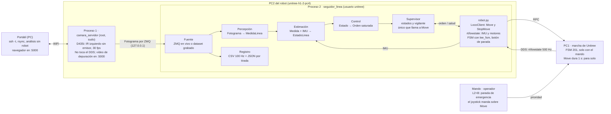
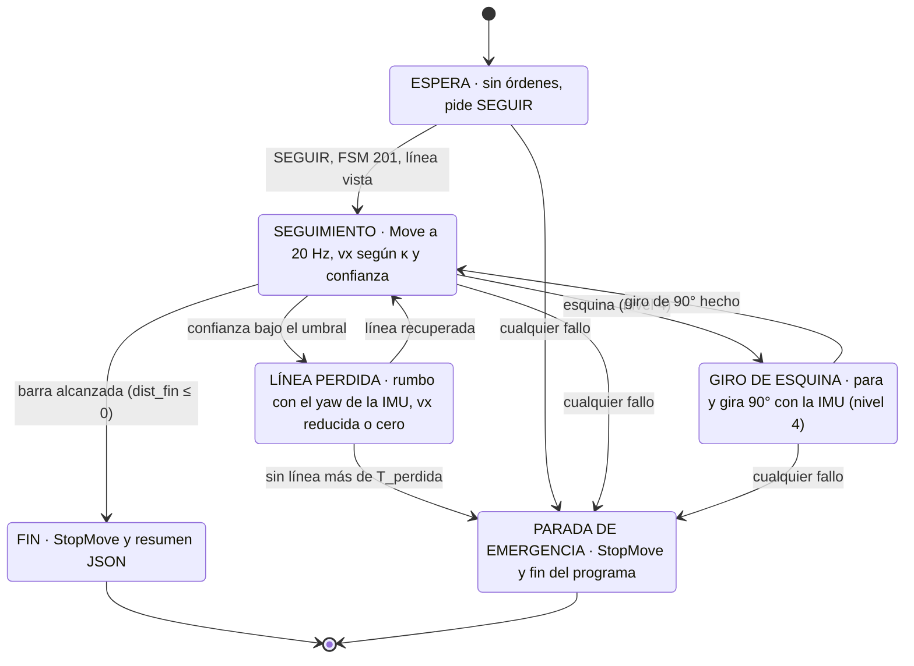
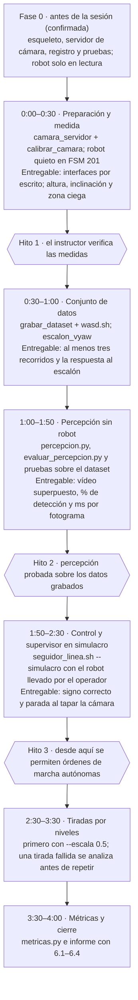

# Plan del reto: H1-2 seguidor de línea

Plan de trabajo del reto `R40-RT-H1_2-0001`, creado el 2026-10-02 y pasado al repo el 2026-10-03.
Se avanza según este plan, pero puede cambiar con los resultados; lo medido y lo que cambió está en
[RESULTADOS.md](RESULTADOS.md). Las casillas de [Orden de implementación](#orden-de-implementación)
marcan el avance real.

**2026-10-05: la cinta blanca se cambió por una negra** y el Hito 1 se repitió con ella (ver
[RESULTADOS.md](RESULTADOS.md)); la tabla del punto de partida es de la cinta blanca.

El seguidor corre entero en el PC2, en dos procesos: la cámara como root y el resto como `unitree`,
porque el DDS no arranca con sudo. Se construye en los cinco bloques del PDF sobre `LocoClient.Move` y
se valida por hitos: medir, grabar, percepción sin robot, simulacro y tiradas a media velocidad.

## Punto de partida

El robot está listo para alto nivel, pero la pista y el entorno difieren del PDF en tres puntos que
cambian el diseño: la cinta es clara, no había barra de fin y el DDS no arranca con sudo. Las medidas
de cámara de esta tabla salen de una sola captura del 2026-10-02: eran preliminares, y las calibradas
del Hito 1 están en [RESULTADOS.md](RESULTADOS.md#1-geometría-de-la-cámara-hito-1).

| Qué | Valor | Cómo se obtuvo | Qué implica |
| --- | --- | --- | --- |
| Estado del robot | FSM 201, `CheckMode='ai'`, 27/27 motores sin fallo, roll 1.5°, pitch 0.5° | `estado.sh` | Correcto para alto nivel; repetir antes de cada tirada |
| Pista | Cinta **clara** sobre suelo **oscuro**, recta de ~4 m, sin barra de fin (se puso después) | Captura IR | El PDF dice lo contrario: la percepción no fija la polaridad |
| Distractores | Una X pintada, el pórtico a la izquierda, reflejos de focos | Captura IR | Validar por ancho (5 cm) y continuidad, no solo por brillo |
| Altura de la cámara | 1.68 m | Plano RANSAC sobre la profundidad | Entra en la proyección píxel → suelo |
| Inclinación | 51.7° (plano) / 53.1° (acelerómetro de la D435i) | Plano y acelerómetro | Difieren 1.4°: promediar varias capturas |
| Suelo visible en color | 0.50–2.91 m (FOV V 43.4°, H 55.8°) | Intrínsecos + geometría | 0.5 m de zona ciega |
| Suelo visible en IR | 0.17–4.78 m (FOV V 64.7°, H 80.4°) | Intrínsecos + geometría | El IR ve casi hasta los pies: es el sensor de partida |
| Cinta en profundidad | No se distingue del suelo | Captura | La profundidad solo sirve para calibrar |
| Emisor IR | Con emisor, puntos sobre la cinta; sin emisor, imagen limpia | Captura con y sin emisor | Emisor apagado durante la marcha |
| Respuesta al giro | Retardo efectivo 0.49 s; gira al 88 % de lo pedido | 49 giros de `datos_cuadrado`, vx = 0, vyaw = 0.4 | Faltaba medirlo andando (vx > 0) |
| Oscilación de la marcha | gz con std 0.27 rad/s en recta; cadencia 1.43 Hz (PDF) | Registros de `cuadrado.py` | Filtrar o compensar con la IMU |
| DDS con sudo | Falla: `fs.protected_regular=2` y `/tmp/cdds.LOG` es de `unitree` | Prueba directa | Cámara y control en dos procesos |
| Python | `teleop_venv`: zmq, cv2 4.11, numpy 1.26, yaml, flask, pyrealsense2 2.58.4, LocoClient; sin pytest ni scipy. PC: mismas cv2 y numpy, con pytest | Importación directa | Pruebas con `unittest` en el robot y `pytest` en la PC |
| Red | Portátil por WiFi (192.168.0.204); robot en 192.168.0.143, ping 10–130 ms | `ping` | El lazo corre en el PC2; la PC solo lanza y mira |
| Cámara | D435i a 5000 Mbps | `camara.sh usb` | Los cuatro flujos caben a 30 fps |

## Arquitectura



El proceso root solo abre la cámara y entrega fotogramas. El segundo proceso contiene los cinco bloques
del PDF y es el único que habla con la marcha.

## Interfaces entre bloques

Cada bloque es una función sobre estos mensajes y no importa el SDK, salvo `robot.py`. Así la percepción
corre igual sobre el dataset que en vivo, y el control se prueba sin cámara. Están en
`seguidor/mensajes.py`.

Convenciones: marco del robot con x adelante, y a la izquierda, z arriba, y origen en la vertical de la
cámara sobre el suelo. Ángulos en rad, positivos antihorario. Tiempos en `time.monotonic()` del PC2. Una
línea a la izquierda da y > 0 y debe producir vyaw > 0.

| Mensaje | De → a | Campos (unidades) | Frecuencia |
| --- | --- | --- | --- |
| `Fotograma` | fuente (cámara por ZMQ o dataset) → percepción, registro | `n`, `t_cam` (s, reloj de la cámara), `t_rx` (s), `ir` (uint8 640×480), `color` (opcional), `emisor` (bool) | 30 Hz |
| `Imu` | `robot.py` (rt/lowstate) → estimación, supervisor, registro | `t` (s), `tick`, `roll`, `pitch`, `yaw` (rad), `gz` (rad/s) | 500 Hz leído, 100 Hz registrado |
| `MedidaLinea` | percepción → estimación | `t` (s, el del fotograma), `y` (m), `theta` (rad), `kappa` (1/m), `objetivo` (x, y en m), `confianza` (0–1), `n_franjas`, `barra_fin` (m o nulo), `esquina` (m y sentido, o nulo), `ms` (proceso) | 30 Hz |
| `EstadoLinea` | estimación → control, supervisor | `t`, `y`, `theta`, `kappa`, `confianza`, `edad_s` (desde la última medida buena), `rumbo_ref` (rad, yaw de la IMU que sigue la línea), `dist_fin` (m restantes, estimados) | 20 Hz |
| `Orden` | control → supervisor | `vx`, `vy` (m/s), `vyaw` (rad/s), ya saturadas con los límites del YAML | 20 Hz |
| `Salud` | `robot.py` → supervisor | `fsm`, `motores_en_fallo`, `edad_lowstate` (s), `edad_fotograma` (s), `boton_parada` (bool) | 20 Hz |
| `Decision` | supervisor → `Move` / `StopMove` y registro | `estado`, `motivo`, `orden_enviada`, `simulacro` (bool) | 20 Hz |

## Decisiones técnicas iniciales

Son puntos de partida, no respuestas: cada valor se sustituye por el medido y entra en el informe con su
método. Las filas marcadas **(revisado)** ya cambiaron con los datos; el detalle está en
[RESULTADOS.md](RESULTADOS.md).

| Pregunta del PDF | Decisión inicial | Dato que la respalda | Cómo se valida |
| --- | --- | --- | --- |
| 6.1.1 Sensor y FOV | IR izquierdo: FOV V 64.7° frente a 43.4° del color | IR ve 0.17–4.78 m; color 0.50–2.91 m | Marcas en el suelo vistas en ambas imágenes |
| 6.1.2 Altura e inclinación **(revisado)** | Plano RANSAC de la profundidad, promediado en ≥ 30 capturas y contrastado con el acelerómetro | 1.68 m; 51.7° / 53.1° | Hecho con dos marcas medidas con cinta y la altura con cinta: el plano solo se queda ~0.8° corto |
| 6.1.3 Zona ciega y alcance | Horizonte útil inicial 0.3–2.5 m, sin los extremos ruidosos | IR 0.17–4.78 m | % de detección por distancia en el dataset |
| 6.1.4 Oscilación al andar | Medir roll y pitch de la IMU y el plano por fotograma mientras anda | Cadencia 1.43 Hz | Dataset caminando |
| 6.1.5 Píxel → suelo **(revisado)** | Proyección inversa sobre el plano, corregida en cada fotograma con roll y pitch de la IMU | Cámara rígida al torso; la IMU está en el torso | Medido: la corrección por roll/pitch empeora la medida; se proyecta con la pose fija |
| 6.2.1 Color, IR o profundidad **(medido)** | IR con el emisor apagado (alternado si hiciera falta profundidad) | Con emisor se ven puntos sobre la cinta | Confirmado: mismo contraste, pero con emisor el margen frente a falsos positivos cae 4 veces |
| 6.2.2 Umbral | Detector de cresta de 5 cm sobre la vista desde arriba, en valor absoluto y con umbral adaptativo por franja | Cinta clara sobre oscuro; sombra en el nivel 3 | Umbral fijo frente a adaptativo en el dataset |
| 6.2.3 Región | Tres franjas: 0.3–0.8, 0.8–1.5 y 1.5–2.5 m | Horizonte medido | % de detección por franja |
| 6.2.4 Distractores | Ancho de 4–7 cm, continuidad entre franjas; la barra es un segmento transversal ≥ 40 cm | X, pórtico y reflejos vistos en la captura | Fotogramas con distractores etiquetados |
| 6.2.5 Confianza | Producto de contraste, ajuste al ancho, residuo de la recta y fracción de franjas con detección | — | ms por fotograma medidos en el PC2 |
| 6.3.1–2 Retardo **(revisado)** | Retardo efectivo ~0.5 s más cámara y proceso (a medir) | 49 giros de `cuadrado.py` | Medido con `escalon_vyaw.py`: 0.3–0.45 s andando a 0.2 m/s, sin zona muerta a 0.15 rad/s |
| 6.3.3 Ley de control | Persecución de un punto adelantado (*pure pursuit*), L = 0.8–1.2 m, vyaw = 2·vx·sin(α)/L | A 0.2 m/s, 0.6 s de retardo son 12 cm; L cabe en el horizonte | Simulacro y error lateral por tirada |
| 6.3.4 vy, vyaw o ambos **(revisado)** | vyaw primero; vy = 0 salvo que una prueba muestre que reduce el error lateral | Andando solo con vx, el robot avanza ~7.5° a la izquierda del eje de la cámara (~3 cm/s) | Probar vy ≈ −0.03 m/s; si no, apuntar la dirección de avance y no el eje de la cámara |
| 6.3.5 Bajada de vx | vx = vx_max · g(κ) · h(confianza), y 0 por debajo de una confianza mínima | — | Suavidad de las órdenes en el registro |
| 6.3.6 Frecuencia de `Move` | 20 Hz, como `cuadrado.py`; el control usa la última estimación y no cuenta dos veces un fotograma | `Move` dura 1 s | Edad del fotograma en el registro |
| 6.4.1 Balanceo **(revisado)** | Compensar con roll y pitch de la IMU por fotograma, más un filtro corto (~0.35 s, media zancada) | Cadencia 1.43 Hz | Medido: no se compensa roll/pitch; se suma el yaw de la IMU al ángulo de la línea |
| 6.4.2 Interrupción de 40 cm | Mantener `rumbo_ref` con el yaw de la IMU, como `cuadrado.py` | Deriva de ~2°/s sin corrección | Nivel 3 |
| 6.4.3 Tiempo sin línea | T = (0.4 m + zona ciega + margen) / vx, unos 3 s a 0.2 m/s; después `StopMove` | — | Tapar la cámara en el simulacro |
| 6.4.4 Parada en la barra | Medir la distancia a la barra mientras se ve (hasta ~0.2 m), descontar vx·factor·t y parar restando la distancia de frenado | Odometría nula; `--factor` de `cuadrado.py` | Distancia de parada con cinta, < 30 cm |
| 6.4.5 Esquina | La franja lejana pierde la línea y aparece un tramo a ±90°; avanzar hasta la esquina, `StopMove`, girar 90° con la IMU y readquirir | Giros de `cuadrado.py` con error final < 3° | Nivel 4 |

## Supervisor



Solo el supervisor llama a `Move` y `StopMove`; el rumbo de referencia se toma al entrar en SEGUIMIENTO.
Causas de PARADA desde cualquier estado: roll o pitch > 20°, motor en fallo, cámara sin fotogramas,
`rt/lowstate` > 0.5 s sin llegar, FSM distinta de 201, excepción, Ctrl+C, joystick fuera de cero o botón
de parada del mando (las que no dependen de la línea ya están en `seguidor/vigilante.py`). En simulacro,
el supervisor recorre los mismos estados y registra la orden que mandaría, pero no llama a `Move`.

## d) Scripts nuevos

Todo va en `seguidor_linea/`, que se copia con rsync a `~/utec/seguidor_linea/` del PC2. De
`~/robotics40` solo se lee, por ejemplo `lectores_h1_2/build/lee_fsm`.

Los lanzadores siguen el patrón de `comun.sh`: se reenvían solos por SSH si no están en el robot, fijan
`PYTHONNOUSERSITE=1`, quitan `CYCLONEDDS_URI` y usan `/home/unitree/teleop_venv/bin/python`. Solo
`camara_servidor.sh` usa sudo, y ese proceso no toca el DDS.

| Fichero | Bloque | Qué hace | Dónde corre | Hito | Estado |
| --- | --- | --- | --- | --- | --- |
| `config/seguidor.yaml` | Configuración | Parámetros de percepción, ganancias, límites (0.4 / 0.2 / 0.5 y su mitad), tiempos del supervisor, palabra de confirmación | Ambos | 1 | hecho |
| `config/geometria.yaml` | Configuración | La escribe `calibrar_camara.py` | Ambos | 1 | calibrado |
| `camara_servidor.py` + `.sh` | Fuente | Como root: abre la D435i, publica `Fotograma` por ZMQ en `tcp://127.0.0.1`, vídeo de depuración en el puerto 5000, reinicia la cámara si deja de dar imágenes | Robot, sudo | 1 | hecho |
| `seguidor/fuentes.py` | Fuente | `FuenteZmq`, `FuenteDataset` (misma interfaz) e `ImuDataset` | Ambos | 1 | hecho |
| `seguidor/geometria.py` | Percepción | Píxel ↔ suelo, plano del suelo y vista desde arriba | Ambos | 1 | hecho |
| `seguidor/calibracion.py` | Percepción | Detectores mínimos de la cinta (línea, barra, marcas) e inclinación por marcas | Ambos | 1 | hecho |
| `seguidor/percepcion.py` | Percepción | `Fotograma` → `MedidaLinea` | Ambos | 2 | |
| `seguidor/estimacion.py` | Estimación | `MedidaLinea` + `Imu` → `EstadoLinea` | Ambos | 3 | |
| `seguidor/control.py` | Control | `EstadoLinea` → `Orden` saturada | Ambos | 3 | |
| `seguidor/supervisor.py` | Supervisor | Máquina de estados; único módulo que llama a `Move` y `StopMove` | Ambos | 3 | |
| `seguidor/vigilante.py` | Supervisor | Paradas de la sección 10 que no dependen de la línea | Ambos | 3 | hecho |
| `seguidor/robot.py` | E/S del robot | LocoClient con `SetTimeout(10)`, `rt/lowstate`, FSM con `lee_fsm`, mando; recorta siempre a 0.4 / 0.2 / 0.5 | Robot | 1 | hecho |
| `seguidor/registro.py` | Registro | CSV de IMU, motores y mando a 100 Hz, CSV genéricos y resumen JSON | Robot | 1 | hecho |
| `seguidor/analisis.py` | Registro | Respuesta a escalones, cadencia, filtros para analizar | PC | Dataset | hecho |
| `seguidor_linea.py` + `.sh` | Principal | `--simulacro`, `--nivel`, `--escala`, `--config`; pide escribir SEGUIR antes de andar | Robot, usuario `unitree` | 3 | |
| `herramientas/comprobar.py` | — | Comprobación previa, solo lectura: robot y cámara | Robot | 1 | hecho |
| `herramientas/calibrar_camara.py` | 6.1 | Plano, marcas medidas con cinta y altura → geometría; yaw de la cámara; escribe el YAML | Robot | 1 | hecho |
| `herramientas/grabar_dataset.py` | Dataset | Fotogramas e IMU con hora común mientras `wasd.sh` lleva el robot | Robot | Dataset | hecho |
| `herramientas/escalon_vyaw.py` | 6.3 | Escalones de vyaw en lazo abierto, registro a 100 Hz, palabra ESCALON | Robot | Dataset | hecho |
| `herramientas/analizar_escalon.py` | 6.3 | Retardo, t63/t90 de arranque y parada, ganancia y figura | PC | Dataset | hecho |
| `herramientas/analizar_dataset.py` | 6.1.4, 6.3, 6.4.1 | Calidad, postura, balanceo, velocidad real y dirección de avance de un dataset | PC | Dataset | hecho |
| `herramientas/evaluar_percepcion.py` | 6.2 | % de detección, confianza, ms por fotograma, vídeo con la línea superpuesta, umbral fijo frente a adaptativo | PC | 2 | |
| `herramientas/reproducir.py` | Simulacro sin robot | Pasa un dataset por estimación, control y supervisor, y compara las órdenes con lo que hizo el operador | PC | 3 | |
| `herramientas/metricas.py` | Sección 9 | Error lateral, % de confianza, tiempo, roll y pitch máximos por tirada | PC | Cierre | |
| `tests/` | Pruebas | Sintéticas (geometría, marcas, signos), del transporte y del vigilante; luego, sobre el dataset y del supervisor | PC con pytest; robot con unittest | 1–3 | en curso |

## a) En la PC

La PC comprueba, despliega, mira y analiza; nada del lazo de control corre aquí. Por WiFi se usa
`unitree@192.168.0.143`; por cable, la PC en 192.168.123.99/24 y `ROBOT_SSH=unitree@192.168.123.164`.

**Comprobar el robot** (estos lanzadores se reenvían solos al robot):

```bash
cd ~/Documents/UTEC/CAPACITACION/code_cap
./robot.sh comprobar     # red, clave SSH y estado (solo lectura)
./estado.sh              # antes de cada tirada: FSM 201, motores, CheckMode
```

**Desplegar el código y traer los registros** (la geometría la escribe el robot: no pisarla):

```bash
cd ~/Documents/h1_2_utec
rsync -av --exclude datos/ --exclude __pycache__ --exclude config/geometria.yaml seguidor_linea/ unitree@192.168.0.143:~/utec/seguidor_linea/
rsync -av unitree@192.168.0.143:~/utec/seguidor_linea/config/geometria.yaml seguidor_linea/config/
rsync -av unitree@192.168.0.143:~/utec/seguidor_linea/datos/ seguidor_linea/datos/
```

**Desarrollar y analizar sin robot:**

```bash
cd ~/Documents/h1_2_utec/seguidor_linea
python3 -m pytest tests/
python3 herramientas/analizar_escalon.py datos/escalon_<fecha>_<...> --figura
python3 herramientas/evaluar_percepcion.py datos/dataset_<fecha>_<nombre> --video   # Hito 2
python3 herramientas/reproducir.py datos/dataset_<fecha>_<nombre>                   # Hito 3
python3 herramientas/metricas.py datos/tirada_<fecha>                               # cierre
```

**Lanzar en el robot**, en terminales separadas, porque el PC2 no tiene `tmux`:

```bash
cd ~/Documents/h1_2_utec/seguidor_linea
./camara_servidor.sh                                    # terminal 1 (pide sudo en el robot)
./ejecutar.sh herramientas/comprobar.py                 # terminal 2
./ejecutar.sh herramientas/grabar_dataset.py --nombre nivel1_b
```

Si se corta el SSH del seguidor, el robot para solo en 1 s, porque cada `Move` dura 1 s. El servidor de
cámara sigue vivo (va con `setsid`) y se para con `./camara_servidor.sh parar`.

## b) En el robot

Cada sesión sigue el mismo orden: `estado.sh`, parar `camara.py` de robotics40 si corre, servidor de
cámara en la terminal 1 y el programa de la fase en la terminal 2. Nada se lanza con el `python3` del
sistema: siempre `teleop_venv`, a través de los lanzadores.

| Programa | Usuario y terminal | Para qué | Cuándo |
| --- | --- | --- | --- |
| `~/robotics40/estado.sh` | `unitree` | FSM 201, motores sin fallo, `CheckMode` | Antes de cada tirada |
| `~/robotics40/camara.sh usb` / `reset` / `parar` | `unitree` (pide sudo) | Velocidad USB, desbloquear la cámara, liberarla | Preparación y fallos |
| `~/robotics40/lectores_h1_2/lectores.sh mando-vivo 10` | `unitree` | Elegir el botón de parada por software | Hito 1 |
| `~/robotics40/wasd.sh --vx 0.2 --vyaw 0.3` | `unitree`, terminal 3 con `ssh -t` | Llevar el robot por la pista mientras se graba | Dataset |
| `lectores_h1_2/build/lee_fsm eth0` | `unitree`, lo llama `robot.py` | Exigir FSM 201 antes de andar | Cada tirada |
| `~/utec/seguidor_linea/camara_servidor.sh` | root por sudo, terminal 1 | Publicar los fotogramas por ZMQ | Toda fase con cámara |
| `herramientas/comprobar.py` | `unitree`, terminal 2 | Robot y cámara, solo lectura | Antes de cada tirada |
| `herramientas/calibrar_camara.py` | `unitree`, terminal 2 | Altura, inclinación, zona ciega, yaw de la cámara | Hito 1 |
| `herramientas/grabar_dataset.py --nombre nivel1_a` | `unitree`, terminal 2 | Imágenes e IMU con hora común | Dataset |
| `herramientas/escalon_vyaw.py` | `unitree`, terminal 2 con `ssh -t` | Respuesta a escalones de vyaw | Dataset |
| `seguidor_linea.sh --simulacro` | `unitree`, terminal 2 | Todo el lazo sin mandar `Move` | Hito 3 |
| `seguidor_linea.sh --nivel N --escala 0.5` | `unitree`, terminal 2 | Tiradas reales; la escala sube a 1 tras una tirada limpia | Niveles |

Los programas de `~/robotics40` no se modifican: solo se ejecutan o se leen.

## c) Con el mando

El operador del mando no hace otra tarea y tiene L2+B listo en todas las fases. El joystick tiene
prioridad sobre `Move`: tocarlo durante una tirada cuenta como intervención (y el vigilante para).

| Fase | Qué hace el operador | Ojo |
| --- | --- | --- |
| Arranque, solo si se reinició | Colgado, postura de cero, encender, esperar ~150 s, L2+B, L2+UP, bajar hasta apoyar los pies, R2+X; soltar el gancho solo si está estable | La postura de encendido fija el cero de las juntas |
| Antes de cada tirada | Comprobar FSM 201 (L2+UP si no lo está); colocar el robot en el cuadro de inicio con los joysticks; en el nivel 1, girarlo ~10° respecto de la línea | Joystick izquierdo: avance y lateral; derecho: giro |
| Al escribir SEGUIR | Joysticks a cero y las manos fuera de ellos | Cualquier eje distinto de cero manda sobre el programa |
| Calibración (Hito 1) | Robot de pie y quieto, alineado con la cinta | Nadie delante de la cámara |
| Dataset | Solo vigila: el robot lo lleva `wasd.sh` | L2+B listo; nadie delante del robot |
| Simulacro (Hito 3) | Lleva el robot con los joysticks por la línea, desviándose a ambos lados; otra persona tapa la cámara un momento | Se comprueban el signo de las órdenes y el vigilante |
| Tiradas | Detrás del robot, solo con L2+B; botón de parada por software si se implementa | L2+B amortigua y el robot cae despacio: último recurso |
| Tras cada tirada | El programa ya mandó `StopMove`; recolocar el robot con los joysticks | Si hubo intervención, explicarla con el registro antes de repetir |
| Fin de sesión | Enganchar al pórtico, L2+B y mantener a la vez los dos botones de batería | — |

El botón de parada por software se elige con `lectores.sh mando-vivo`. Debe ser uno sin función en FSM
201: ni A, B, X, Y, SELECT, START ni combinaciones con L2 o R2.

## Plan por hitos



Nada camina solo hasta pasar el Hito 3. El orden y las puertas son los del PDF; la fase 0 está
confirmada: el código se escribe antes de la sesión.

## Orden de implementación

Se implementa en el orden en que los hitos lo necesitan, y cada tarea termina con su prueba.

**Fase 0: esqueleto, sin mover el robot**

- [x] Crear `seguidor_linea/` con `README.md`, `config/seguidor.yaml` y los mensajes de la tabla de interfaces
- [x] `camara_servidor.py` + `.sh`: sudo, ZMQ, emisor apagado, vídeo de depuración y reinicio automático
- [x] `robot.py`: `rt/lowstate`, FSM con `lee_fsm` y LocoClient; probar solo la lectura
- [x] `registro.py` con el mismo formato que `datos_cuadrado/`
- [x] `fuentes.py`: comprobar que un fotograma sale igual por ZMQ y por el dataset

**Hito 1: medida**

- [x] `calibrar_camara.py`: plano, marcas, altura con cinta, zona ciega y yaw de la cámara; escribe el YAML
- [x] Marcas en el suelo para comprobar la proyección (se usaron una marca a 1.00 m y la barra a 3.58 m de la puntera)
- [ ] Elegir el botón de parada con `lectores.sh mando-vivo`

**Dataset**

- [x] `grabar_dataset.py`: tres recorridos con la cinta blanca (2026-10-03) y cuatro con la negra (2026-10-05)
- [x] `analizar_dataset.py`: calidad, postura, balanceo, velocidad real y dirección de avance
- [x] Repetir "girado a la izquierda" con la cinta negra (pierde la línea en ~4 s: peor caso)
- [x] Uno con el emisor encendido (6.2.1): emisor apagado para andar
- [ ] Uno con sombra (6.2.2)
- [x] `escalon_vyaw.py` y `analizar_escalon.py`: vx = 0 y vx = 0.2 con A = 0.3 rad/s
- [x] Escalones de 3 s andando, con 0.3 y 0.15 rad/s: ver [RESULTADOS.md](RESULTADOS.md#2-respuesta-al-giro-631-y-632)

**Hito 2: percepción sin robot**

- [x] `geometria.py`, con pruebas sobre marcas conocidas
- [ ] `percepcion.py`: vista desde arriba, cresta sin polaridad, franjas, confianza, barra y esquina
- [ ] `evaluar_percepcion.py`: % de detección, ms por fotograma, vídeo superpuesto, umbral fijo frente a adaptativo
- [ ] Pruebas automáticas sobre el dataset

**Hito 3: control y supervisor en simulacro**

- [ ] `estimacion.py`, `control.py` y `supervisor.py`, con los límites leídos del YAML (`vigilante.py` ya está)
- [ ] `reproducir.py` sobre el dataset, y pruebas de signos y de transiciones
- [ ] `seguidor_linea.sh --simulacro` con el robot llevado por el mando; tapar la cámara debe llevar a parada

**Niveles y cierre**

- [ ] Nivel 1 a media velocidad y después a 0.4 m/s, ajustando con los registros
- [ ] Niveles 2, 3 y 4, en ese orden
- [ ] `metricas.py` y el informe con las respuestas a 6.1–6.4

## Confirmaciones

- [x] ¿Se puede escribir el código antes de la sesión de 4 h? Sí: hay fase 0.
- [x] ¿Quién pone la barra de fin de 60 cm? El responsable del reto; ya está puesta en la recta de 4 m. Las pistas de los niveles 2 a 4, sin fecha.
- [x] ¿Se permite `escalon_vyaw.py` antes del Hito 3? Sí.
- [x] ¿La carpeta va en la raíz del repo (`seguidor_linea/`) y en `~/utec/seguidor_linea/` del PC2? Sí.
- [ ] ¿Se trabaja por cable o por WiFi? Solo afecta a ver el vídeo y copiar datos, no al lazo.
- [ ] ¿Quién opera el mando en las tiradas?
- [ ] ¿Se puede instalar algo en el PC2, como pytest en `teleop_venv`? Si no, las pruebas del robot usan `unittest`.

## Fuentes

- Enunciado: `~/Documents/UTEC/CAPACITACION/Reto_Seguidor_Linea_H1_2_Robotics40.pdf` (R40-RT-H1_2-0001 v1.0)
- Capacitación: `~/Documents/UTEC/CAPACITACION/Capacitacion_H1_2_Robotics40.pdf` (R40-CAP-H1_2-0001) y su resumen en [`docs/CAPACITACION_H1_2.md`](../../docs/CAPACITACION_H1_2.md)
- Código de referencia: `code_cap/wasd.py`, `cuadrado.py`, `comun.sh` y `camara.sh`; en el robot, `~/robotics40/camara.py` (versión del 27 de septiembre)
- Registros: `code_cap/datos_cuadrado/`, de donde salen los 49 giros del punto de partida
- Medidas propias: ver [RESULTADOS.md](RESULTADOS.md)
