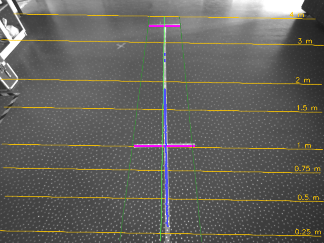
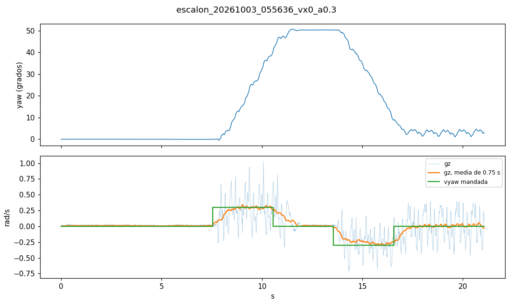
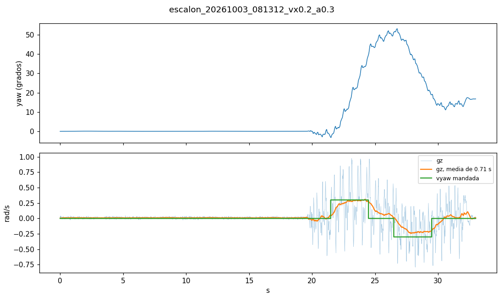
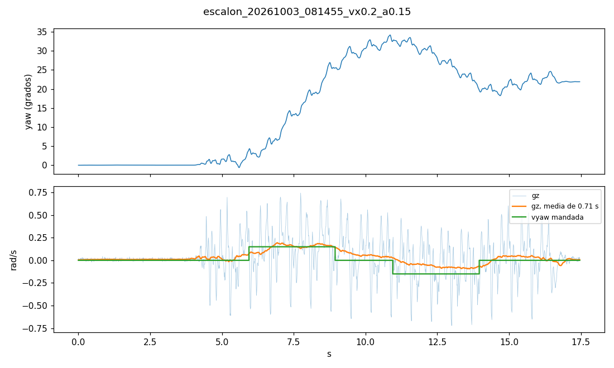

# Resultados del reto: lo medido hasta ahora

Lo obtenido en el robot y en los datos, con su método, para el informe final (preguntas 6.1–6.4 del
PDF) y para decidir sobre el [plan](PLAN.md). Cada apartado dice de dónde salen los números. Los datos
crudos están en `seguidor_linea/datos/` de la PC y `~/utec/seguidor_linea/datos/` del robot, fuera de
git; las figuras clave están copiadas en [`img/`](img/).

Estado al 2026-10-03: Hito 1 (geometría) cerrado; dataset del nivel 1 grabado; respuesta al giro medida
andando con 0.3 y 0.15 rad/s; el balanceo de la marcha ya está caracterizado. Lo siguiente es la percepción (Hito 2).

## 1. Geometría de la cámara (Hito 1)

Calibración del 2026-10-03 con `herramientas/calibrar_camara.py`, robot de pie en FSM 201, quieto y
alineado con la línea, emisor encendido y luces apagadas. Resultado en `config/geometria.yaml`; datos en
`datos/calibracion_20261003_054617/`.

| Medida | Valor | Método |
| --- | --- | --- |
| Altura de la cámara | **1.65 m** | Cinta métrica, del suelo al centro del cristal. La profundidad da 1.677 m (+1.6 %) |
| Inclinación | **50.66°** bajo la horizontal | Dos tramos de cinta medidos desde la puntera: marca a 1.00 m y barra de fin a 3.58 m. Es la inclinación que los separa 2.58 m en el suelo |
| Inclinación del plano de profundidad | 49.90° (desviación 0.29° entre 30 capturas) | RANSAC sobre la mediana de 30 capturas, puntos hasta 3 m. Se queda 0.76° corto |
| Roll | −0.95° (desviación 0.21°) | Plano de profundidad |
| Yaw respecto del cuerpo | **−1.0°** (−0.94° a −1.07° en 4 pasadas válidas) | Línea vista con los pies paralelos a la cinta |
| IMU del torso en la calibración | roll +1.50°, pitch −1.08° | Media durante las capturas |
| Puntera de los pies | +0.01 m de la vertical de la cámara | Marca a 1.00 m de la puntera |
| Suelo visible en IR | de 0.19 a 4.86 m de la vertical de la cámara (desde 0.18 m por delante de los pies) | Geometría calibrada |
| FOV IR / color | IR: H 80.4°, V 64.7°. Color: H 55.8°, V 43.4° | Intrínsecos de la D435i |

*Distancias del suelo (amarillo), eje del robot y ±30 cm (verde), marca y barra detectadas (magenta) y
puntos de la línea (azul).*

**Comprobaciones independientes.** Con 50.66°, la marca y la barra aparecen con 0.60 y 0.59 m de largo
(miden 0.60). Además, la puntera queda justo fuera de la imagen, como se ve en el IR; con la inclinación
del plano (49.9°) y la altura de la profundidad, la puntera habría salido a 0.26 m y se tendría que ver.

**Respuestas para el informe:**

- **6.1.1:** el IR ve más suelo (FOV V 64.7° frente a 43.4°): de 0.19 a 4.86 m, frente a ~0.5–2.9 m del color.
- **6.1.2:** altura 1.65 m e inclinación 50.66°. El plano de profundidad solo, sin cinta, da 1.677 m y 49.9°.
- **6.1.3:** el suelo se ve desde 0.18 m por delante de los pies: casi no hay zona ciega en IR. Con el color, unos 0.5 m.

**Lo aprendido al calibrar:**

- **Calibrar con el emisor encendido.** Sin él, la profundidad de este suelo dispersa 3–15 cm entre
  0.5 y 3 m y tiene −18 cm de sesgo más allá de 4 m; la inclinación salía entre 50.1° y 53.4° según los
  puntos usados.
- **El plano solo no basta:** se queda ~0.8° corto, y la profundidad sobrestima la altura un 1.6 %.
  Con la altura medida con cinta y dos marcas, la geometría queda fijada.
- Con las luces encendidas aparecen reflejos de los focos en el suelo; al apagarlas desaparecen y la
  cinta sigue igual de visible (130 frente a 89 de suelo, con emisor). Para calibrar ayuda apagarlas;
  para grabar y andar, no: hay que hacerlo con la luz real del reto.
- Con poca luz, los puntos del emisor dominan el IR: los detectores llevan una mediana 3×3 antes del
  top-hat. Detalle en `seguidor/calibracion.py`.

## 2. Respuesta al giro (6.3.1 y 6.3.2)

Escalones de vyaw en lazo abierto con `herramientas/escalon_vyaw.py` (primero +A, luego −A), analizados
con `herramientas/analizar_escalon.py` sobre el `lowstate.csv` a 100 Hz. Datos en
`datos/escalon_20261003_<hora>_<prueba>/`.

| Prueba (hora) | Escalón | Orden | Ganancia | Retardo efectivo | t63 arranque | t90 arranque | t63 parada |
| --- | --- | --- | --- | --- | --- | --- | --- |
| vx = 0, 3 s (`055636`) | 1.º | +0.30 rad/s | 0.95 | 0.47 s | 0.58 s | 0.96 s | 0.61 s |
| vx = 0, 3 s (`055636`) | 2.º | −0.30 rad/s | 0.96 | 0.53 s | 0.43 s | 0.87 s | 0.46 s |
| vx = 0.2, 2 s (`055747`) | 1.º | +0.30 rad/s | 0.91 | 0.30 s | 0.41 s | 1.09 s | 0.57 s |
| vx = 0.2, 2 s (`055747`) | 2.º† | −0.30 rad/s | 0.79 | 0.40 s | 0.44 s | 0.86 s | 0.61 s |
| **vx = 0.2, 3 s (`081312`)** | **1.º** | **+0.30 rad/s** | **0.94** | **0.31 s** | **0.48 s** | **1.23 s** | **0.47 s** |
| vx = 0.2, 3 s (`081312`) | 2.º† | −0.30 rad/s | 0.98 | 0.43 s | 0.54 s | 1.06 s | 0.68 s |
| **vx = 0.2, 3 s (`081455`)** | **1.º** | **+0.15 rad/s** | **1.04** | **0.46 s** | **0.64 s** | **0.78 s** | **0.46 s** |
| vx = 0.2, 3 s (`081455`) | 2.º† | −0.15 rad/s | 0.79 | 0.39 s | 0.47 s | 1.46 s | 0.43 s |

- **Retardo efectivo:** donde la recta de régimen del giro (sobre el yaw, sin la deriva de la base)
  corta el cero. Recoge el tiempo muerto más media subida.
- **t63 / t90:** sobre gz con una media centrada de un periodo de paso, que quita el balanceo sin
  retrasar. Por eso el 10 % sale adelantado y no se da.
- **Con `Move(0, 0, 0)` el robot está quieto, no da pasos en el sitio:** a vx = 0 el giro incluye arrancar
  la marcha. El caso del seguidor, siempre andando, es el de vx = 0.2.
- †**El segundo escalón es menos fiable.** Tras cada escalón el robot tarda ~1.5 s en dejar de girar
  (t63 de parada ~0.5–0.7 s): con 2 s de vuelta, la base del segundo escalón aún arrastra giro (deriva
  ajustada de +2.1 y +3.5°/s), que el análisis descuenta como si siguiera. Los valores de referencia son
  los del primer escalón (en negrita).
- **Andando, el robot deriva a la izquierda ~1.2–1.7°/s** (0.02–0.03 rad/s): los giros a la izquierda
  salen más rápidos que lo mandado y los de la derecha más lentos (con 0.15 rad/s, unos +0.18 frente a
  −0.10–0.12 rad/s en la figura). Coincide con el dataset `060224`, que con solo W se fue ~1.5°/s a la
  izquierda.
- **No hay zona muerta andando:** 0.15 rad/s da ~0.15 rad/s (ganancia ~1.0). El "por debajo de
  ~0.15 rad/s apenas gira" de la capacitación es para girar en el sitio.
- El RPC de `Move` tarda 0.5 ms de mediana y 1.1 ms como máximo.

**Para el control (6.3.3):** andando a 0.2 m/s, la marcha responde a vyaw con ganancia ~0.95, un retardo
efectivo de **0.3–0.45 s** y llega al 90 % en ~0.8–1.2 s; para de girar con una constante parecida. Sobre
eso hay una deriva de ~0.02–0.03 rad/s, el 15–20 % de una corrección de 0.15 rad/s: el lazo tiene que
cerrarse sobre el rumbo (IMU) o la línea con acción integral, no en lazo abierto. A 0.2 m/s, 0.4 s de
retardo son 8 cm de avance: un punto adelantado de 0.8–1.2 m deja margen.

**Presupuesto de latencia hasta ahora (6.3.2):** fotograma → proceso por ZMQ 1 ms; desfase cámara–IMU
~10 ms (apartado 4); RPC de `Move` 0.5 ms; respuesta de la marcha 0.3–0.45 s de retardo efectivo. La
marcha domina; falta medir el tiempo de la percepción por fotograma (Hito 2).

## 3. Conjunto de datos del nivel 1

Grabado el 2026-10-03 con `herramientas/grabar_dataset.py` y `wasd.sh`, en la recta de 4 m con barra de
fin. IR sin emisor a 30 fps, luces encendidas, ningún fotograma perdido, IMU a 100 Hz con el mismo reloj.

| Dataset | Recorrido | Duración | Fotogramas | Giro total | Línea vista* |
| --- | --- | --- | --- | --- | --- |
| `dataset_20261003_060224_nivel1_a` | Sale paralelo, solo W: se desvía a la izquierda (~1.5°/s) y acaba fuera de la pista | 42.0 s | 1260 | +26.4° | 63 % |
| `dataset_20261003_060638_nivel1_a` | Sale girado a la derecha, W hasta pasar la barra | 36.1 s | 1083 | +13.2° | 99 % |
| `dataset_20261003_061005_nivel1_a` | Sale paralelo, W y desvíos con Q/E (hasta −23°) | 38.6 s | 1159 | −6.9° | 92 % |

\*Con el detector mínimo de la calibración (≥ 20 puntos). Los fallos están al final: fuera de la pista
o al cruzar la barra, donde se engancha a otras cosas. La percepción tiene que dar ahí confianza baja.

Distractores presentes: 4–6 reflejos de focos, piernas y zapatillas de personas, la X del suelo, la
barra y, fuera de la pista, puertas y muebles. En las próximas grabaciones no habrá nadie delante.

## 4. Balanceo de la marcha (6.1.4 y 6.4.1)

Sobre los tres datasets, con los fotogramas en movimiento y la línea bien vista (≥ 100 puntos; el final
de la pista contamina las estadísticas). "Oscilación" es la desviación de la parte rápida de la medida:
la señal menos su media móvil centrada de ~1 s.

- **Cadencia** (pico del espectro del roll): 1.33–1.40 Hz. **Balanceo del torso:** roll 3–3.5° y pitch
  2.4–3° de pico a pico.
- **Ruido del detector con el robot quieto:** 0.06° y 0.1 cm entre fotogramas seguidos. Lo que se mide andando es movimiento real.
- **Oscilación de la línea andando, sin corregir:** ~1 cm de desplazamiento lateral y ~1° de ángulo.

**Corregir con el roll y el pitch de la IMU empeora la medida** (`dataset_20261003_060638`):

| Corrección | Desplazamiento lateral | Ángulo | Distancia mediana |
| --- | --- | --- | --- |
| Ninguna (pose calibrada fija) | **1.01 cm** | 0.98° | **0.69 cm** |
| roll y pitch | 3.17 cm | 0.97° | 1.59 cm |
| −roll y pitch | 2.86 cm | 0.98° | 1.70 cm |
| roll y −pitch | 3.15 cm | 0.99° | 2.43 cm |
| −roll y −pitch | 3.03 cm | 0.98° | 2.33 cm |
| ejes cambiados | 1.30 cm | 0.97° | 4.15 cm |
| solo roll | 3.16 cm | 0.98° | 0.73 cm |
| solo pitch | 0.93 cm | 0.97° | 1.63 cm |

El torso se balancea como un péndulo invertido sobre los tobillos: la cámara gira y a la vez se desplaza
(1.65 m × 1.5° ≈ 4 cm), y vistas desde el cuerpo las dos cosas casi se anulan. Girar la cámara sobre su
centro, que es lo que hace la corrección, mete el error en vez de quitarlo. Los otros dos datasets dan lo
mismo (≈ 1 cm sin corregir, ≈ 3.2 cm con roll y pitch).

**El yaw sí se compensa:** sumando el yaw de la IMU al ángulo de la línea (dirección en un marco fijo),
la oscilación cae de ~1.0° a **0.04–0.07°**. El mínimo está con la IMU 10 ms antes de que llegue el
fotograma, que es el desfase cámara–IMU:

| IMU respecto del fotograma | −30 ms | −20 ms | −10 ms | 0 ms | **+10 ms** | +20 ms | +30 ms |
| --- | --- | --- | --- | --- | --- | --- | --- |
| Oscilación del ángulo + yaw (`060638`) | 0.48° | 0.37° | 0.25° | 0.11° | **0.04°** | 0.16° | 0.30° |

**Decisión (cambia el plan en 6.1.5 y 6.4.1):**

- Proyectar con la pose calibrada fija, sin roll/pitch.
- Expresar la dirección de la línea en un marco fijo con el yaw de la IMU, tomado 10 ms antes de la llegada del fotograma.
- Que un lazo de rumbo sobre la IMU la siga, como `cuadrado.py`. Ese mismo rumbo sirve para cruzar la interrupción de 40 cm (6.4.2).

## 5. Hallazgos del entorno

- **El DDS no arranca con sudo** (`fs.protected_regular=2`, `/tmp/cdds.LOG` es de `unitree`): la cámara,
  que exige sudo, va en un proceso aparte (`camara_servidor.py`) y pasa los fotogramas por ZMQ.
- En el PC2, `sudo` pide contraseña: el servidor de cámara lo arranca una persona con `ssh -t`.
- La cámara solo la abre un proceso: hay que parar `~/robotics40/camara.py` antes.
- El portátil va por WiFi (ping 10–130 ms): todo el lazo corre en el PC2.
- Corregido: `ordenes.csv` redondeaba los instantes a 10 ms (6 cifras con `time.monotonic()` en ~6600 s).
  Ya se escriben con 12 cifras; los resultados de esta página salen del `lowstate.csv`, que no estaba afectado.

## 6. Pendiente

- Si hace falta afinar el segundo escalón: repetir con `--vuelta 3` (el robot tarda ~1.5 s en dejar de girar).
- Un recorrido con sombra (nivel 3) y otro con el emisor encendido, para 6.2.1 y 6.2.2.
- La respuesta a un escalón de vy (6.3.4): `escalon_vyaw.py` aún no lo hace.
- Elegir el botón de parada por software con `lectores.sh mando-vivo`.
- Hito 2: `percepcion.py` y `evaluar_percepcion.py` sobre estos datasets.
