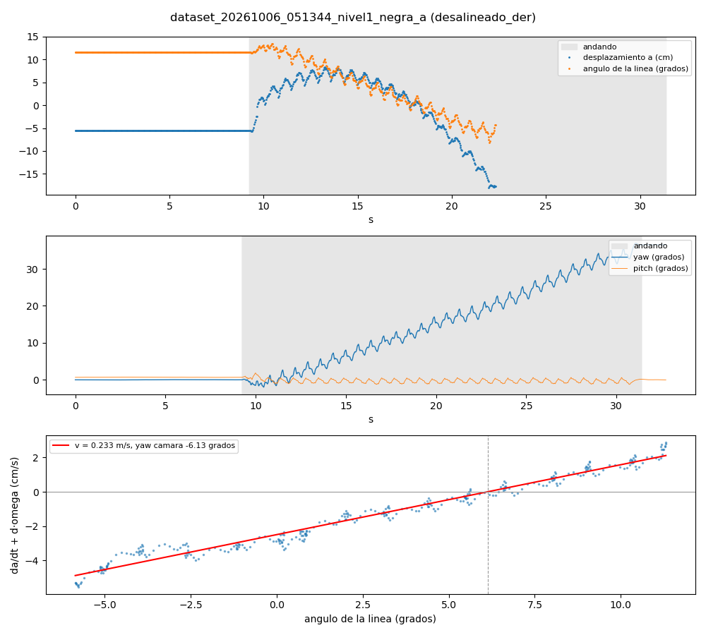
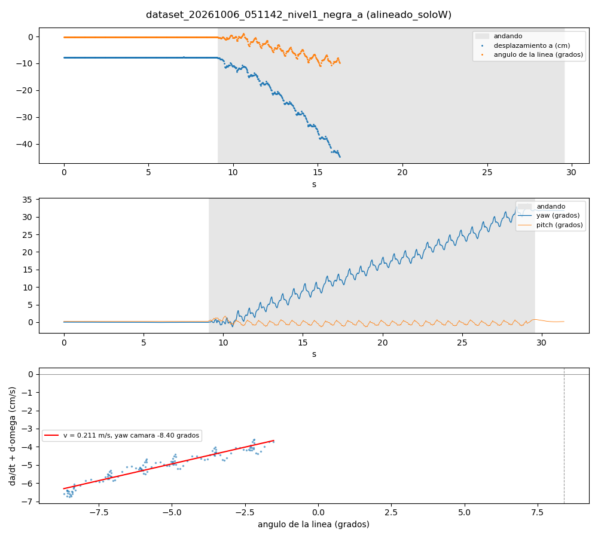
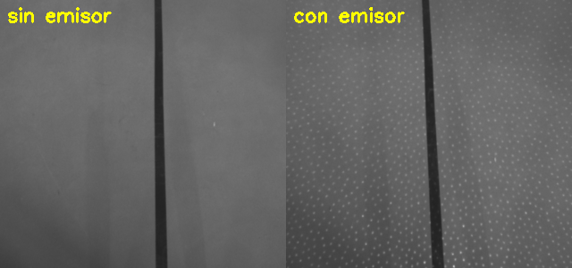
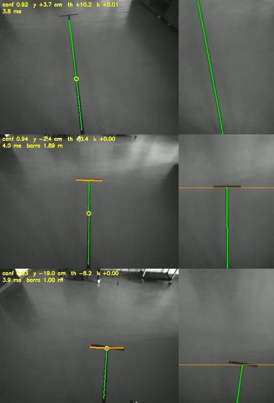
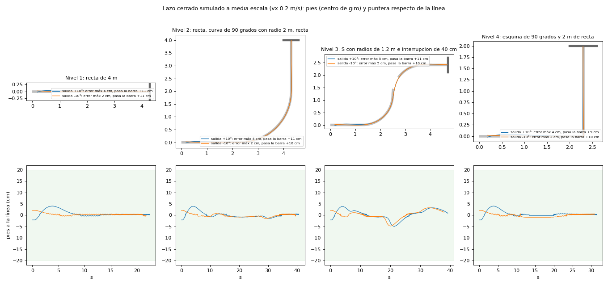

# Resultados del reto: lo medido hasta ahora

Lo obtenido en el robot y en los datos, con su método, para el informe final (preguntas 6.1–6.4 del
PDF) y para decidir sobre el [plan](PLAN.md). Cada apartado dice de dónde salen los números. Los datos
crudos están en `seguidor_linea/datos/` de la PC y `~/utec/seguidor_linea/datos/` del robot, fuera de
git; las figuras clave están copiadas en [`img/`](img/).

Estado al 2026-10-05: **la cinta se cambió por una negra** (más oscura que el suelo); el Hito 1 se repitió
con ella, se grabaron los recorridos nuevos y **la percepción (Hito 2) está hecha y probada sobre ellos**
(apartado 5). **La estimación, el control y el supervisor (Hito 3) están escritos y probados sin robot**
(apartado 6), y el simulacro en el robot salió bien tras corregir tres fallos que destapó. De ellos sale la velocidad real y que **el robot avanza
en diagonal, ~7.5° a la izquierda del eje de la cámara y un 14 % más rápido de lo mandado** (apartado 3). La respuesta al giro y el balanceo no
dependen de la cinta y siguen valiendo. Lo siguiente es el visto bueno del Hito 3 y las tiradas del nivel 1.

## 1. Geometría de la cámara (Hito 1)

Calibración del 2026-10-05 con `herramientas/calibrar_camara.py` sobre la **cinta negra**: robot de pie en
FSM 201, quieto, con los pies paralelos a la línea, y emisor encendido. Tramos transversales de 60 cm
con el borde cercano a 1.00 m y a 4.00 m de la puntera. Resultado en `config/geometria.yaml`; datos en
`datos/calibracion_20261006_042634/` (la carpeta lleva la fecha del reloj del robot, en hora de China).

| Medida | 2026-10-05 (cinta negra) | 2026-10-03 (cinta blanca) | Método |
| --- | --- | --- | --- |
| Altura de la cámara | **1.66 m** | 1.65 m | Cinta métrica, del suelo al centro del cristal (remedida el 2026-10-05; la calibración se hizo con 1.65 m y se recalculó); la profundidad da 1.672 m y 1.677 m |
| Inclinación | **54.10°** | 50.66° | La que separa en el suelo los dos tramos lo mismo que la cinta (3.00 m y 2.58 m); con 1.65 m salía 53.99° |
| Inclinación del plano de profundidad | 53.08° (desv. 0.15°) | 49.90° (desv. 0.29°) | RANSAC sobre la mediana de 30 capturas, hasta 3 m: se queda 0.9° y 0.8° corto |
| Pitch del torso (IMU) | **+1.81°** | −1.08° | Media durante las capturas |
| Inclinación − pitch del torso | **52.29°** | 51.74° | La de la cámara respecto del torso: difiere 0.55° |
| Roll | −0.67° | −0.95° | Plano de profundidad (roll del torso +1.51° y +1.50°) |
| Yaw respecto de los pies | +3.08° | −1.0° | Línea vista con los pies "paralelos" a la cinta: ver abajo |
| Puntera de los pies | −0.02 m | +0.01 m | Respecto de la vertical de la cámara, por la marca de 1 m |
| Suelo visible en IR | de 0.10 a **4.07 m** | de 0.19 a 4.86 m | Desde la vertical de la cámara; la barra de 4 m queda en el borde de la imagen |
| Largo aparente de marca y barra | 0.61 y 0.57 m | 0.60 y 0.59 m | Miden 0.60 m: comprobación de la escala |
| FOV IR / color | IR: H 80.4°, V 64.7°. Color: H 55.8°, V 43.4° | | Intrínsecos de la D435i |


*Calibración del 2026-10-05: distancias del suelo (amarillo), eje de la cámara y ±30 cm (verde), marca y
barra detectadas (magenta) y puntos de la línea (azul).*

**La postura del torso mueve la cámara.** Entre sesiones el pitch del torso de pie pasó de −1.08° a
+1.81°, y en una misma sesión varió de +1.1° a −0.2° y a +1.8° en pocos minutos. La cámara va rígida al
torso: la inclinación cambió 3.3° (plano: 3.2°) para 2.9° de pitch. Lo que se conserva es la inclinación
**respecto del torso** (52.2° frente a 51.7°). A 3.5 m, 1° de inclinación son ~20 cm de distancia, lo que
importa para parar en la barra. Por eso la geometría se usa con el pitch y el roll de la IMU **filtrados
lentos** respecto de los de la calibración (`ModeloSuelo` con `imu_pitch_ref`), que no es lo mismo que
corregir el balanceo de cada paso (apartado 4).

**El yaw estático no es fiable.** La cintura (junta 12) estaba a 0.0° en las dos calibraciones, así que
el torso no estaba girado respecto de las piernas: la diferencia de 4° viene de que los pies no estaban
igual de paralelos a la cinta, alineados a ojo. Hay que medirlo mejor: con cinta, la distancia de la
línea al borde interior de un pie en el talón y en la puntera, o andando, con la dirección real de avance.

**Respuestas para el informe:**

- **6.1.1:** el IR ve más suelo (FOV V 64.7° frente a 43.4° del color): con la inclinación de hoy, de 0.10 a 4.07 m.
- **6.1.2:** altura 1.65 m e inclinación 52.2° respecto del torso (53.99° con el torso a +1.81°). El plano de
  profundidad solo, sin cinta, da 1.672 m y 0.9° menos.
- **6.1.3:** con el IR casi no hay zona ciega: el suelo se ve desde la vertical de los pies (0.12 m por
  delante de la puntera hoy, 0.18 m el 2026-10-03). El alcance útil depende de la postura: 4.07 a 4.86 m.

**Lo aprendido al calibrar:**

- **Calibrar con el emisor encendido.** Sin él, la profundidad de este suelo dispersa 3–15 cm entre
  0.5 y 3 m y tiene −18 cm de sesgo más allá de 4 m; la inclinación salía entre 50.1° y 53.4° según los
  puntos usados.
- **El plano solo no basta:** se queda 0.8–0.9° corto y la profundidad sobrestima la altura un 1.4–1.6 %,
  las dos veces igual. Con la altura medida con cinta y dos marcas, la geometría queda fijada.
- Con las luces encendidas aparecen reflejos de los focos en el suelo; al apagarlas desaparecen y la
  cinta blanca seguía igual de visible (130 frente a 89 de suelo, con emisor). La cinta negra se ve
  oscura sobre el suelo, que en el IR sale más claro. Para calibrar ayuda apagar las luces; para grabar
  y andar, no: hay que hacerlo con la luz real del reto.
- Con poca luz, los puntos del emisor dominan el IR: los detectores llevan una mediana 3×3 antes del
  top-hat. Detalle en `seguidor/calibracion.py`.

## 2. Respuesta al giro (6.3.1 y 6.3.2)

Escalones de vyaw en lazo abierto con `herramientas/escalon_vyaw.py` (primero +A, luego −A), analizados
con `herramientas/analizar_escalon.py` sobre el `lowstate.csv` a 100 Hz. Datos en
`datos/escalon_20261003_<hora>_<prueba>/`.

| Prueba (hora) | Escalón | Orden | Ganancia | Retardo efectivo | t63 arranque | t90 arranque | t63 parada |
| --- | --- | --- | --- | --- | --- | --- | --- |
| vx = 0, 3 s (`055636`) | 1.º | +0.30 rad/s | 0.95 | 0.47 s | 0.58 s | 0.96 s | 0.61 s |
| vx = 0, 3 s (`055636`) | 2.º | −0.30 rad/s | 0.96 | 0.53 s | 0.43 s | 0.87 s | 0.46 s |
| vx = 0.2, 2 s (`055747`) | 1.º | +0.30 rad/s | 0.91 | 0.30 s | 0.41 s | 1.09 s | 0.57 s |
| vx = 0.2, 2 s (`055747`) | 2.º† | −0.30 rad/s | 0.79 | 0.40 s | 0.44 s | 0.86 s | 0.61 s |
| **vx = 0.2, 3 s (`081312`)** | **1.º** | **+0.30 rad/s** | **0.94** | **0.31 s** | **0.48 s** | **1.23 s** | **0.47 s** |
| vx = 0.2, 3 s (`081312`) | 2.º† | −0.30 rad/s | 0.98 | 0.43 s | 0.54 s | 1.06 s | 0.68 s |
| **vx = 0.2, 3 s (`081455`)** | **1.º** | **+0.15 rad/s** | **1.04** | **0.46 s** | **0.64 s** | **0.78 s** | **0.46 s** |
| vx = 0.2, 3 s (`081455`) | 2.º† | −0.15 rad/s | 0.79 | 0.39 s | 0.47 s | 1.46 s | 0.43 s |

- **Retardo efectivo:** donde la recta de régimen del giro (sobre el yaw, sin la deriva de la base)
  corta el cero. Recoge el tiempo muerto más media subida.
- **t63 / t90:** sobre gz con una media centrada de un periodo de paso, que quita el balanceo sin
  retrasar. Por eso el 10 % sale adelantado y no se da.
- **Con `Move(0, 0, 0)` el robot está quieto, no da pasos en el sitio:** a vx = 0 el giro incluye arrancar
  la marcha. El caso del seguidor, siempre andando, es el de vx = 0.2.
- †**El segundo escalón es menos fiable.** Tras cada escalón el robot tarda ~1.5 s en dejar de girar
  (t63 de parada ~0.5–0.7 s): con 2 s de vuelta, la base del segundo escalón aún arrastra giro (deriva
  ajustada de +2.1 y +3.5°/s), que el análisis descuenta como si siguiera. Los valores de referencia son
  los del primer escalón (en negrita).
- **Andando, el robot deriva a la izquierda ~1.2–1.7°/s** (0.02–0.03 rad/s): los giros a la izquierda
  salen más rápidos que lo mandado y los de la derecha más lentos (con 0.15 rad/s, unos +0.18 frente a
  −0.10–0.12 rad/s en la figura). Coincide con el dataset `060224`, que con solo W se fue ~1.5°/s a la
  izquierda.
- **No hay zona muerta andando:** 0.15 rad/s da ~0.15 rad/s (ganancia ~1.0). El "por debajo de
  ~0.15 rad/s apenas gira" de la capacitación es para girar en el sitio.
- El RPC de `Move` tarda 0.5 ms de mediana y 1.1 ms como máximo.

**Para el control (6.3.3):** andando a 0.2 m/s, la marcha responde a vyaw con ganancia ~0.95, un retardo
efectivo de **0.3–0.45 s** y llega al 90 % en ~0.8–1.2 s; para de girar con una constante parecida. Sobre
eso hay una deriva de ~0.02–0.03 rad/s, el 15–20 % de una corrección de 0.15 rad/s: el lazo tiene que
cerrarse sobre el rumbo (IMU) o la línea con acción integral, no en lazo abierto. A 0.2 m/s, 0.4 s de
retardo son 8 cm de avance: un punto adelantado de 0.8–1.2 m deja margen.


**Presupuesto de latencia hasta ahora (6.3.2):** fotograma → proceso por ZMQ 1 ms; desfase cámara–IMU
~10 ms (apartado 4); RPC de `Move` 0.5 ms; respuesta de la marcha 0.3–0.45 s de retardo efectivo. La
marcha domina; falta medir el tiempo de la percepción por fotograma (Hito 2).

## 3. Conjuntos de datos del nivel 1 y avance real

### Cinta negra (2026-10-05)

Grabados con `herramientas/grabar_dataset.py` mientras un operador llevaba el robot con `wasd.sh`, en la
recta de 4 m con la barra de fin a 4.00 m de la puntera. IR sin emisor a 30 fps, ningún fotograma
perdido, IMU a 100 Hz con el mismo reloj, nadie delante. Analizados con `herramientas/analizar_dataset.py`
(deja `analisis.json` y `analisis.png` en cada carpeta).

| Dataset | Recorrido | Duración (andando) | Giro total | Línea vista andando* | Velocidad real | Yaw cámara–avance |
| --- | --- | --- | --- | --- | --- | --- |
| `dataset_20261006_051142_nivel1_negra_a` | Alineado, solo W | 31.4 s (20.5 s) | +31.8° | 35 % | 0.211 m/s | −8.4° |
| `dataset_20261006_051344_nivel1_negra_a` | Girado a la derecha, solo W | 32.7 s (22.2 s) | +36.5° | 59 % | 0.233 m/s | −6.1° |
| `dataset_20261006_051545_nivel1_negra_a` | Girado a la izquierda, solo W | 26.3 s (15.8 s) | +20.9° | 25 % | no fiable | no fiable |
| `dataset_20261006_054236_nivel1_negra_b` | Girado a la izquierda, solo W (repetición) | 24.0 s (14.8 s) | +29.3° | 33 % | no fiable | no fiable |
| `dataset_20261006_054959_nivel1_negra_emisor` | Alineado, solo W, **con emisor** | 33.0 s (22.5 s) | +39.3° | 47 % | 0.243 m/s | −7.9° |
| `dataset_20261006_051715_nivel1_negra_a` | Zigzag con Q/E | 43.9 s (30.8 s) | −42.6° | 49 % | 0.228 m/s | −8.7° |
| `dataset_20261006_045509_nivel1_negra_a`† | Girado a la derecha, solo W | 36.0 s (23.3 s) | +38.9° | 54 % | 0.224 m/s | −7.5° |
| `dataset_20261006_045707_nivel1_negra_a`† | Girado a la izquierda, solo W | 30.2 s (16.6 s) | +29.8° | 30 % | no fiable | no fiable |
| `dataset_20261006_045836_nivel1_negra_a`† | Zigzag | 45.5 s (27.6 s) | −13.2° | 58 % | 0.165 m/s | −12.4° |

\*Incluye el tramo andando después de pasar la barra, fuera de la pista. Con la línea a la vista, el
detector mínimo la encuentra con ~160 puntos por fotograma. **Arrancar girado a la izquierda es el peor
caso:** los dos sesgos del robot (avance en diagonal y rumbo, ambos a la izquierda) lo alejan de la línea,
que sale de la imagen por la derecha en ~4 s (a ~11 cm/s). Las tres veces el ángulo de la línea recorrió
menos de 4°, así que la regresión del avance no separa v de φ (`analizar_dataset.py` la marca como no
fiable con < 100 puntos o < 5° de recorrido). Sirven como datos de percepción, no para el avance. †Grabados antes, con la marca transversal de 1 m todavía en el suelo:
sirven para comprobar distancias (marca y barra a 3.00 m entre sí). En el resto, la marca ya no estaba.
Todos con `wasd.sh --vx 0.2 --vyaw 0.3`.

Distractores: el pórtico, la barra y, fuera de la pista, puertas, muebles y el brillo de las ventanas.

### Avance real: velocidad y dirección, sin odometría

Vista desde la cámara, la línea es y = a + tan(θ)·x. Si la cámara avanza a `v` en la dirección `φ` (de
su propio marco) y el robot gira a `ω` alrededor de un punto `d` por detrás de la cámara:

```latex
\frac{da}{dt} = v\,(\theta - \varphi) - d\,\omega
```

La regresión de da/dt frente a θ y a ω (el yaw de la IMU derivado) da `v`, `φ` y `d`, con a, θ y ω
suavizados con una media centrada de 1 s (quita el balanceo) y sin el primer segundo y medio de cada
arranque (`seguidor/analisis.py: direccion_de_avance`, probado con datos sintéticos en `tests/`).



*Girado a la derecha: el desplazamiento de la línea deja de cambiar cuando la línea se ve a +6–7° en la
imagen, no a 0°.*

Con los cuatro recorridos de solo W con regresión fiable (`051142`, `051344`, `045509` y `054959`; los
zigzags tienen 5–10 veces más residuo):

- **Velocidad real: 0.228 m/s de media (0.211–0.243) para vx = 0.2: el robot anda un 14 % más rápido de
  lo mandado** (factor 1.05–1.21). Es el `--factor` de `cuadrado.py`, medido sin cinta.
- **El robot avanza en diagonal hacia su izquierda: 7.5 ± 1.0° respecto del eje de la cámara** (6.1–8.4°),
  unos 3 cm/s de deriva lateral, además de que su rumbo gira ~1.5°/s a la izquierda. Se ve sin
  regresión en el recorrido alineado: con la línea a 0° en la imagen, al arrancar se desplaza a la
  derecha 4–5 cm/s.
- El centro de giro queda 8–18 cm por detrás de la vertical de la cámara (la puntera).
- El yaw "estático" de la calibración (+3.1°, −1.0°, con los pies alineados a ojo) no lo predice: el robot
  no avanza hacia donde apuntan los pies.
- **Postura andando:** el pitch del torso baja 0.5–1.0° respecto de estar de pie (de +0.25…+0.84° a
  −0.26…−0.01°) y el roll pasa de +1.3…+1.65° a +0.64…+0.77°. Respecto de la calibración (pitch +1.81°),
  andando la cámara mira ~2° menos hacia abajo: a 3.5 m son ~40 cm. Confirma que hace falta la
  corrección lenta de la postura (apartado 1).

**Corrección lenta de la postura, comprobada.** En los recorridos con la marca, la marca y la barra se
ven a la vez: su separación tiene que ser 3.00 m. Con roll y pitch de la IMU suavizados 1.5 s respecto de
los de la calibración (`ModeloSuelo` con `imu_pitch_ref`):

| Recorrido | Pitch del torso (calibración +1.81°) | Separación, geometría fija | Separación, con postura lenta |
| --- | --- | --- | --- |
| `045509` de pie (269 fotogramas) | −0.99° | 2.505 m (−16 %) | 2.872 m (−4 %) |
| `045509` andando (119) | −0.12° | 2.663 m (−11 %) | 2.881 m (−4 %) |
| `045707` andando (16) | +0.44° | 2.747 m (−8 %) | 2.934 m (−2 %) |
| `045836` andando (110) | +0.28° | 2.765 m (−8 %) | 2.942 m (−2 %) |

La corrección divide el error entre 3 y 4. Lo que queda (−2 a −4 %) no es la altura: con la remedida
(1.66 m) y la inclinación recalculada con las mismas marcas sale igual (−4.2, −2.2 y −1.8 %).

**Para el control (6.3.3 y 6.3.4):** la ley de control tiene que llevar la *dirección de avance* (≈ 7.5° a
la izquierda del eje de la cámara) hacia la línea, no el eje de la cámara, o cerrarse con acción integral.
Una alternativa es compensar la diagonal con vy ≈ −0.03 m/s (a la derecha), que hay que probar.



### Emisor encendido o apagado (6.2.1)

Mismo recorrido (alineado, solo W) sin emisor (`051142`) y con emisor (`054959`), comparados con el robot
de pie antes de arrancar (~250 fotogramas cada uno):

| | Sin emisor | Con emisor |
| --- | --- | --- |
| Contraste de la cinta negra (suelo − cinta) | 62.6 niveles | 62.0 niveles |
| Ruido del suelo (desviación en un parche liso) | 6.7 | 7.1 |
| Respuesta del filtro de línea en la cinta / 1 % más alto del suelo | **21.2** | **5.6** |
| Puntos de línea por fotograma | 160 | 161 |
| Variación del detector entre fotogramas (desplazamiento, ángulo) | 0.01 cm, 0.002° | 0.01 cm, 0.005° |



La cinta se ve igual: absorbe también los puntos del emisor. Lo que cambia es el margen frente a falsos
positivos: los puntos del emisor son estructuras pequeñas, como la cinta, para el filtro que busca la línea,
y el margen cae casi 4 veces. Con la cinta negra todavía sobra, pero en la sombra del nivel 3 bajará el
contraste. Al apagarlo se pierde la calidad de la profundidad (3–15 cm de dispersión sin emisor, apartado
1), que solo se usa para calibrar. **Decisión: emisor apagado para andar y encendido solo para calibrar.**

### Cinta blanca (2026-10-03)

Sirven para probar que la percepción no depende de la polaridad. IR sin emisor a 30 fps, luces encendidas.

| Dataset | Recorrido | Duración | Fotogramas | Giro total | Línea vista* |
| --- | --- | --- | --- | --- | --- |
| `dataset_20261003_060224_nivel1_a` | Sale paralelo, solo W: se desvía a la izquierda (~1.5°/s) y acaba fuera de la pista | 42.0 s | 1260 | +26.4° | 63 % |
| `dataset_20261003_060638_nivel1_a` | Sale girado a la derecha, W hasta pasar la barra | 36.1 s | 1083 | +13.2° | 99 % |
| `dataset_20261003_061005_nivel1_a` | Sale paralelo, W y desvíos con Q/E (hasta −23°) | 38.6 s | 1159 | −6.9° | 92 % |

\*Con el detector mínimo de la calibración (≥ 20 puntos). Distractores: 4–6 reflejos de focos, piernas
y zapatillas de personas, la X del suelo y la barra.

## 4. Balanceo de la marcha (6.1.4 y 6.4.1)

Sobre los tres datasets, con los fotogramas en movimiento y la línea bien vista (≥ 100 puntos; el final
de la pista contamina las estadísticas). "Oscilación" es la desviación de la parte rápida de la medida:
la señal menos su media móvil centrada de ~1 s.

- **Cadencia** (pico del espectro del roll): 1.33–1.40 Hz. **Balanceo del torso:** roll 3–3.5° y pitch
  2.4–3° de pico a pico.
- **Ruido del detector con el robot quieto:** 0.06° y 0.1 cm entre fotogramas seguidos. Lo que se mide andando es movimiento real.
- **Oscilación de la línea andando, sin corregir:** ~1 cm de desplazamiento lateral y ~1° de ángulo.

**Corregir con el roll y el pitch de la IMU empeora la medida** (`dataset_20261003_060638`):

| Corrección | Desplazamiento lateral | Ángulo | Distancia mediana |
| --- | --- | --- | --- |
| Ninguna (pose calibrada fija) | **1.01 cm** | 0.98° | **0.69 cm** |
| roll y pitch | 3.17 cm | 0.97° | 1.59 cm |
| −roll y pitch | 2.86 cm | 0.98° | 1.70 cm |
| roll y −pitch | 3.15 cm | 0.99° | 2.43 cm |
| −roll y −pitch | 3.03 cm | 0.98° | 2.33 cm |
| ejes cambiados | 1.30 cm | 0.97° | 4.15 cm |
| solo roll | 3.16 cm | 0.98° | 0.73 cm |
| solo pitch | 0.93 cm | 0.97° | 1.63 cm |

El torso se balancea como un péndulo invertido sobre los tobillos: la cámara gira y a la vez se desplaza
(1.65 m × 1.5° ≈ 4 cm), y vistas desde el cuerpo las dos cosas casi se anulan. Girar la cámara sobre su
centro, que es lo que hace la corrección, mete el error en vez de quitarlo. Los otros dos datasets dan lo
mismo (≈ 1 cm sin corregir, ≈ 3.2 cm con roll y pitch).

**El yaw sí se compensa:** sumando el yaw de la IMU al ángulo de la línea (dirección en un marco fijo),
la oscilación cae de ~1.0° a **0.04–0.07°**. El mínimo está con la IMU 10 ms antes de que llegue el
fotograma, que es el desfase cámara–IMU:

| IMU respecto del fotograma | −30 ms | −20 ms | −10 ms | 0 ms | **+10 ms** | +20 ms | +30 ms |
| --- | --- | --- | --- | --- | --- | --- | --- |
| Oscilación del ángulo + yaw (`060638`) | 0.48° | 0.37° | 0.25° | 0.11° | **0.04°** | 0.16° | 0.30° |

Con la cinta negra (2026-10-05, `analizar_dataset.py`) se repite: el ángulo oscila 0.86–1.05° y, con el
yaw de la IMU, 0.10–0.13° (0.28° en el zigzag); el desplazamiento lateral, 0.84–0.98 cm; cadencia
1.41–1.46 Hz.

**Decisión (cambia el plan en 6.1.5 y 6.4.1):**

- Proyectar sin corregir el balanceo de cada paso con el roll/pitch de la IMU; sí con su parte lenta
  (la postura del torso, apartado 1), filtrada por debajo de la cadencia.
- Expresar la dirección de la línea en un marco fijo con el yaw de la IMU, tomado 10 ms antes de la llegada del fotograma.
- Que un lazo de rumbo sobre la IMU la siga, como `cuadrado.py`. Ese mismo rumbo sirve para cruzar la interrupción de 40 cm (6.4.2).

## 5. Percepción (Hito 2)

`seguidor/percepcion.py` convierte cada fotograma en una `MedidaLinea`; `herramientas/evaluar_percepcion.py`
la pasa por los datasets (con la postura lenta de la IMU) y la compara con un detector independiente, el
mínimo de la calibración. Pruebas: 13 sintéticas (`tests/test_percepcion.py`: recta, curva, cinta oscura y
clara, barra, barra con el robot girado, cruce, esquina, sin línea, borde de puerta, puntos del emisor,
sombra, interrupción de 40 cm) y una de regresión sobre el recorrido alineado de la cinta negra.

**Cómo funciona:**

1. Vista desde arriba del suelo a 1 cm por píxel (0.2–3.0 m por delante, ±1 m a los lados), con la
   geometría calibrada y la postura lenta del torso. Ahí la cinta mide siempre 5 cm.
2. Filtro de franja de 5 cm **con contraste a los dos lados**: un borde (una puerta, un mueble) solo tiene
   contraste a un lado y no cuenta.
3. Las dos polaridades en cada fotograma; se queda la de más confianza. Umbral adaptativo por franja (6
   veces el ruido robusto, mínimo 6 niveles).
4. Ajuste robusto de recta o parábola sobre la **cadena continua** desde el punto más cercano, cortada en
   el primer hueco de más de 0.5 m (la interrupción del nivel 3 es de 0.4 m).
5. Barra de fin y esquina: cinta transversal **medida en perpendicular a la línea**, justo donde acaba.
6. Confianza = filas con línea × contraste × residuo del ajuste.

**Resultados con umbral adaptativo** (12 datasets, ~1000 fotogramas cada uno):

| Dataset | Detectada (conf ≥ 0.5) | Donde la referencia ve la línea | Frente a la referencia: y / ángulo | Polaridad | Barra seguida | Se acerca a |
| --- | --- | --- | --- | --- | --- | --- |
| `051142` alineado, solo W | 61 % | 100 % | 0.3 cm / 0.41° | oscura, 100 % | 2.91 → 2.40 m | — |
| `051344` girado a la derecha | 76 % | 100 % | 1.9 cm / 0.15° | oscura, 100 % | 2.89 → 0.31 m | 0.232 m/s |
| `045509` girado a la derecha† | 63 % | 100 % | 2.0 cm / 0.22° | oscura, 100 % | 2.90 → 0.99 m | 0.229 m/s |
| `051545` girado a la izquierda | 52 % | 100 % | 1.2 cm / 0.05° | oscura, 100 % | — | — |
| `045707` girado a la izquierda† | 57 % | 100 % | 0.4 cm / 0.08° | oscura, 100 % | — | — |
| `054236` girado a la izquierda | 52 % | 91 % | 1.0 cm / 0.05° | oscura, 100 % | — | — |
| `051715` zigzag | 73 % | 100 % | 1.1 cm / 0.28° | oscura, 100 % | 2.90 → 0.48 m | 0.149 m/s |
| `045836` zigzag† | 82 % | 100 % | 1.5 cm / 0.11° | oscura, 100 % | 2.93 → 0.45 m | 0.123 m/s |
| `054959` con emisor | 60 % | 100 % | 1.6 cm / 0.18° | oscura, 100 % | 2.95 → 1.20 m | 0.240 m/s |
| `060224` cinta blanca | 48 % | 98 % | 0.9 cm / 0.53° | clara, 100 % | 2.89 → 1.88 m | 0.257 m/s |
| `060638` cinta blanca | 71 % | 97 % | 1.4 cm / 0.34° | clara, 100 % | 2.93 → 0.79 m | 0.243 m/s |
| `061005` cinta blanca | 77 % | 99 % | 0.2 cm / 0.40° | clara, 100 % | 2.91 → 0.39 m | 0.221 m/s |

- **Donde la línea se ve, se detecta: 99 % de media** respecto de la referencia. El total ronda el 50–80 %
  porque los recorridos siguen andando fuera de la pista después de pasar la barra.
- Las detecciones que la referencia no tiene (2–49 %) son la línea de verdad donde la referencia no llega:
  muy girada, a más de 0.6 m a un lado o tan corta, cerca de la barra, que no reúne 60 puntos. Revisado
  en los vídeos (`evaluacion_adaptativo.mp4`).
- **Tiempo: 3.1–3.4 ms por fotograma de mediana y 6.1–6.4 ms de p95 en el PC2** (4.0 y 8 ms en la PC):
  sobra margen a 30 fps (33 ms).
- La barra se sigue desde ~2.9 m hasta 0.3 m; la velocidad a la que se acerca (0.22–0.26 m/s) coincide
  con la del avance medido en el apartado 3. En los zigzags es menor porque el camino no es recto.
- La polaridad sale bien en todos: oscura con la cinta negra y clara con la blanca.



*`051344`: línea y punto adelantado (círculo); barra a 1.89 m y a 1.00 m; a la derecha, la vista desde arriba.*

**Lo que corrigió cada iteración** (con los datasets):

| Problema | Cambio |
| --- | --- |
| Barra no detectada con el robot girado | Cobertura medida en perpendicular a la línea, no por filas de la vista |
| Bordes de puertas y muebles del fondo unidos a la línea | La línea es la cadena continua desde el punto más cercano |
| Canto de una puerta detectado como línea (confianza 0.6) | Filtro de franja con contraste a los dos lados |
| Polaridad invertida tras salir de la pista | Las dos polaridades en cada fotograma |
| Esquina falsa con un lado fuera de la vista | Sin decidir hasta ver los dos lados |
| En una curva de 1.2 m de radio salía una recta de 0.3–0.9 m con confianza 0.14–0.26: la línea se daría por perdida en plena curva (lo destapó el simulador del apartado 6) | Parábola que crece desde el tramo cercano, y la confianza no cuenta las filas por donde la curva ya salió de la vista si la línea viene de debajo del robot. Ahora 0.56–0.82, y el punto adelantado a 1–2 cm del real |
| Tramos cortos junto al borde de la vista (cantos de muebles) con confianza 0.6–0.7 tras salir de la pista | La estimación descarta medidas a más de 25 cm o 25° de la línea predicha (apartado 6) |

**Umbral fijo o adaptativo (6.2.2).** En los datasets (sin sombra) el fijo (15 niveles) detecta algo
menos donde se ve la línea (98 % de media, con mínimos de 86–95 %) y admite más falsos en el suelo más
ruidoso de la cinta blanca (10 % frente a 0 % en `060224`). Con una sombra sintética sobre la mitad de la
pista:

| Luz en la sombra | Contraste de la cinta | Adaptativo: confianza, alcance | Fijo: confianza, alcance |
| --- | --- | --- | --- |
| ×1.0 | 60 niveles | 1.00, 2.99 m | 0.97, 2.99 m |
| ×0.5 | 30 niveles | 1.00, 2.99 m | 0.49, 2.99 m |
| ×0.35 | 21 niveles | 0.85, 2.99 m | 0.34, 2.99 m |
| ×0.25 | 15 niveles | 0.61, 2.99 m | 0.72, **1.21 m** |
| ×0.15 | 9 niveles | 0.36, 2.99 m | 0.71, **1.20 m** |

El adaptativo sigue la línea dentro de la sombra y baja la confianza con el contraste; el fijo la pierde
por debajo de su umbral y, además, da más confianza justo cuando ve menos. Hay que confirmarlo en la zona de
sombra real del nivel 3.

Con el ajuste de las curvas, sobre los 12 datasets: sigue el 99 % donde la referencia ve la línea, el
ángulo coincide mejor con ella (0.01–0.15° frente a 0.05–0.53°) y aparecen más detecciones donde la
referencia no llega; revisadas en los vídeos, casi todas son la línea de verdad lejos a un lado.

## 6. Estimación, control y supervisor (Hito 3)

`seguidor/estimacion.py`, `seguidor/control.py` y `seguidor/supervisor.py`, con el programa principal
`seguidor_linea.py` (`seguidor_linea.sh`). Se probaron sin robot de dos formas:

- **Lazo cerrado simulado** (`seguidor/simulador.py`, `herramientas/simular.py`): el mismo código sobre un
  modelo de la marcha con lo medido (retardo efectivo ~0.45 s, deriva 0.026 rad/s, avance a 1.14 × vx y
  7.5° a la izquierda, centro de giro 14 cm detrás, balanceo de yaw) y las pistas de los cuatro niveles
  del PDF. La cámara simulada usa el mismo ajuste que la percepción.
- **Datasets reales** (`herramientas/reproducir.py`): percepción → estimación → control → supervisor en
  simulacro con la IMU grabada.

Pruebas automáticas: 78 (32 nuevas: estimación, control, supervisor con un robot que anota cada `Move` y
lazo simulado de los cuatro niveles).

**Estimación (6.4.1–6.4.4).** La línea medida se guarda en un marco fijo al suelo, girada con el yaw de la
IMU de 10 ms antes del fotograma, y en cada ciclo se vuelve a poner en el marco actual de la cámara. Sin
medida se desplaza con la estima de avance: rumbo por la IMU y avance a 1.14 × vx (con una constante de
0.5 s), 7.5° a la izquierda. La barra y la esquina se dan por buenas tras 5 avistamientos coherentes y se
siguen contando a ciegas. Una medida a más de 25 cm o 25° de la línea predicha no se usa mientras esta
sea reciente y la respalden 3 medidas.

A ciegas sobre los datos reales (`reproducir.py`, tapando la cámara 2 s cada 4 s mientras se anda en los
12 datasets), la línea predicha queda a **1.5–5.7 cm** de mediana de la que se mide al volver (máximo
6.5 cm) y a **menos de 0.3°**. Para la interrupción de 40 cm, ni hace falta: la cadena de la percepción
salta huecos de hasta 0.5 m.

**Control (6.3.3–6.3.6).** Pure pursuit desde el **centro de giro** y sobre la **dirección real de
avance**:

    alfa = ángulo entre la dirección de avance (7.5° a la izquierda del eje) y el punto adelantado
    vyaw = 2 · v · sin(alfa) / L − 0.026 rad/s          v = 1.14 · vx,  L = 0.6 m
    vx   = 0.4 · escala · 1/(1 + 0.5·|curvatura|) · h(confianza) · cos(alfa)   (× 0.6 a menos de 1 m de la barra)

con rampas (0.5 m/s², 1 rad/s²) y la escala sobre vx y vyaw_max. `Move` a 20 Hz; la percepción procesa
todos los fotogramas (30 Hz) y cada ciclo usa la última estimación llevada al instante actual, así que
no cuenta dos veces un fotograma (6.3.6). vy = 0 (6.3.4).

Dos decisiones salieron del simulador:

- **El centro de giro, no la cámara.** En las curvas la cámara, 14 cm por delante, se desplaza además
  ω·d hacia dentro (~6° en la S); con la ley aplicada en la cámara el robot recortaba ~20 cm la S.
- **L = 0.6 m.** Con L más largo el pure pursuit recorta la entrada de las curvas cerradas:

| L | Error máximo de los pies, nivel 3 (escala 0.5) | Con la peor marcha a la vez | 
| --- | --- | --- |
| 1.0 m | 15.7 cm | — |
| 0.8 m | 9.6 cm | 10/14 tiradas con éxito (nivel 3 a 21–29 cm) |
| **0.6 m** | **5.6 cm** | **14/14** (máximo 20 cm) |

Robustez con L = 0.6 m frente a errores del modelo de la marcha (14 tiradas por fila: cuatro niveles,
curvas a los dos lados, saliendo girado ±10°):

| Marcha simulada | Escala 0.5: éxito, error máx., pasa la barra | Escala 1: éxito, error máx., pasa la barra |
| --- | --- | --- |
| La medida | 14/14, 5.6 cm, +10…+13 cm | 14/14, 6.2 cm, +9…+13 cm |
| Retardo ×2 | 14/14, 6.3 cm, +11…+14 cm | 14/14, 12.2 cm, +14…+17 cm |
| Deriva ×2 | 14/14, 9.6 cm, +9…+13 cm | 14/14, 7.8 cm, +10…+13 cm |
| Ganancia de giro 0.8 | 14/14, 9.1 cm, +9…+12 cm | 14/14, 8.5 cm, +11…+13 cm |
| Avanza a 1.0 × vx (no 1.14) | 14/14, 5.0 cm, +4…+7 cm | 14/14, 5.1 cm, +5…+7 cm |
| Avanza a 1.3 × vx | 14/14, 8.4 cm, +15…+18 cm | 14/14, 11.8 cm, +16…+19 cm |
| Avanza a 4° o a 11° (no 7.5°) | 14/14, 8.5 y 10.7 cm | 14/14, 6.7 y 12.6 cm |
| Balanceo ×2 | 14/14, 5.6 cm | 14/14, 5.7 cm |
| Todo lo peor junto | 14/14, 20.0 cm, +10…+14 cm | 14/14, 19.2 cm, +13…+18 cm |

El éxito es el del PDF: llegar a la barra pasándola 0–30 cm, y el centro de los pies a menos de 20 cm de la
línea (los pies están a ±10 cm: el pie no sale de 30 cm).

**Supervisor.** ESPERA → SEGUIMIENTO con 5 medidas buenas seguidas; LÍNEA PERDIDA si no hay medida buena en
0.3 s (sigue la línea estimada a 0.6 × vx) y PARADA a los 3 s; con la barra a menos de 0.6 m no ver la
línea es lo normal (zona ciega). **Fin (6.4.4):** se manda `StopMove` cuando, sumando lo que anda al frenar
(v × 0.5 s), la puntera quedaría 10 cm más allá del borde cercano de la barra; el PDF admite pasarse hasta
30 cm. **El tiempo de frenado de 0.5 s es supuesto: hay que medirlo con cinta en la primera tirada.**
**Esquina (6.4.5, nivel 4):** cuando el centro de giro llega a ella (contando el frenado), `StopMove`, 1 s
quieto, giro de 90° en el sitio sobre la IMU como `cuadrado.py` y SEGUIMIENTO al ver la línea nueva.
Causas de PARADA: las del vigilante, la FSM distinta de 201 (se lee cada 2 s en segundo plano), la línea
perdida, la duración máxima, Ctrl+C y cualquier excepción.



| Nivel (simulado, salida ±10°) | Escala 0.5: tiempo, error medio / máximo, pasa la barra | Escala 1 |
| --- | --- | --- |
| 1: recta de 4 m | 22 s, 0.5–1.0 / 2.1–4.0 cm, +11 cm | 11 s, 0.5–0.8 / 2.1–3.0 cm, +12 cm |
| 2: curva de radio 2 m | 40–42 s, 0.6–1.3 / 2.1–3.9 cm, +10…+12 cm | 20–21 s, 0.7–1.2 / 2.1–2.9 cm, +11…+15 cm |
| 3: S de radio 1.2 m e interrupción | 38–39 s, 1.5–2.5 / 4.8–5.6 cm, +10…+13 cm | 19–20 s, 1.3–2.2 / 2.8–6.0 cm, +10…+14 cm |
| 4: esquina | 31–32 s, 0.5–1.1 / 2.1–4.0 cm, +9…+11 cm | 17–18 s, 0.9–1.0 / 2.7–3.0 cm, +11…+13 cm |

**Sobre los datasets reales** (`reproducir.py`, 12 recorridos): todo el lazo corre sin fallos, el giro que
mandaría tiene el signo correcto el 97–100 % del tiempo (línea a la izquierda → vyaw a la izquierda), la
suavidad de vyaw entre órdenes es de 0.007–0.013 rad/s y el supervisor pasa a FIN en los recorridos que
llegan a la barra.

**Límites de lo simulado:** la marcha es lineal y sin tropiezos, y la cámara simulada no tiene sombras ni
falsos; lo de la percepción real está en el apartado 5. Las curvas, la interrupción y la esquina solo se
han probado así: hay que grabarlas cuando estén las pistas.

### Simulacro en el robot (2026-10-06)

`./seguidor_linea.sh --nivel 1 --simulacro` en el PC2, con el robot llevado por el operador con el mando:
todo el lazo en vivo, sin ningún `Move` (no se crea el LocoClient). Datos en
`datos/tirada_20261006_<hora>_nivel1_simulacro/`. Primera ronda (08:14–09:10) y, tras corregir lo que
salió, segunda ronda (09:32–09:44):

| Prueba | Esperado | Resultado (segunda ronda) |
| --- | --- | --- |
| Signos con el robot quieto: alineado, girado ±25°, desplazado ±30 cm | vyaw −0.11, −0.20 / +0.09, −0.21 / +0.14 | −0.12…−0.16; −0.11…−0.21 / +0.01…+0.05 (con la línea además a −4/−7 cm); −0.16…−0.21 / **+0.12…+0.14** |
| Tapar la cámara 1.5 s y luego 5 s (caja de cartón y caja oscura) | LÍNEA PERDIDA a 0.3 s; vuelve al destapar; PARADA a 3 s | Igual en los dos: **PARADA a 3.0 s** de la última medida buena, sin volver a SEGUIMIENTO con la caja delante |
| Sin línea al empezar (girado 90°) | PARADA a 5 s | `ESPERA → PARADA: sin línea clara 5 s después de SEGUIR` |
| Parar el servidor de cámara en SEGUIMIENTO | PARADA en ~0.5 s | `PARADA: cámara sin fotogramas desde hace 0.54 s` |
| Recorrido hasta la barra (con y sin las luces del techo) | La distancia baja; FIN cerca de la barra | Barra vista de 2.88 a 0.31 m; FIN (ver abajo) |

Percepción en vivo: 3.8–6.3 ms por fotograma de mediana; ESPERA → SEGUIMIENTO en 0.2 s.

**Lo que destapó la primera ronda y se corrigió:**

| Problema (primera ronda) | Causa | Corrección |
| --- | --- | --- |
| Con el robot 30 cm a la derecha de la línea, LÍNEA PERDIDA y PARADA | Los **reflejos de los focos del techo** en el suelo (IR) borran la cinta 50–60 cm; el corte por continuidad la dejaba en 0.21–0.80 m con confianza 0.2 | Un hueco se salta si lo de más allá sigue la prolongación de lo de más acá (hasta 1 m). En esos fotogramas: 0.76–0.92 y hasta 2.99 m |
| Con la cámara tapada por una caja volvía a SEGUIMIENTO a ratos y **la PARADA llegó a los ~13 s, no a los 3 s** | Falsos en el borde lateral de la vista (y ≈ ±1 m): `np.roll` da la vuelta y comparaba la columna de un lado con la del otro. Pasado 1 s, la estimación aceptaba cualquier medida y eso refrescaba la edad | Bordes de la vista fuera del filtro (12 → 1 falso con la caja, y ese era la línea al tapar). Además, una línea distinta de la estimada solo se adopta con 3 medidas seguidas coherentes |
| En el tramo final a ciegas la velocidad estimada caía a 0.04 m/s | La confianza de la última medida (poca línea antes de la barra) frenaba | Con la barra confirmada cerca no frena por confianza; tope de 6 s a ciegas |

**Parada en la barra con la velocidad medida (6.4.4).** En simulacro la distancia a ciegas se contaba con la
velocidad que se habría mandado (0.05–0.09 m/s), no con la del operador (0.18 y 0.39 m/s): FIN llegaba
3 s tarde o no llegaba. Ahora, mientras la barra se ve, su distancia baja a la velocidad real del robot y
esa velocidad (recta sobre el último 1.2 s de avistamientos) sigue el tramo final a ciegas y da la
distancia de frenado. Reproduciendo los dos recorridos con el código nuevo:

| Recorrido | Velocidad real | La puntera cruza la barra | FIN | Puntera al mandar FIN | Final previsto |
| --- | --- | --- | --- | --- | --- |
| Sin luces del techo (`094240`) | 0.17 m/s | ~16.8 s | 17.25 s | 2 cm pasada | ~+10 cm |
| Con luces (`094410`) | 0.39 m/s | ~13.7 s | 13.6 s | 9 cm antes | ~+10 cm (frena ~19 cm) |

En el simulador deja de depender del factor de velocidad (con 1.0 y 1.3 la parada queda en +7…+18 cm; antes
+4…+7 y +15…+18) y sigue 14/14 en todas las variantes de la marcha.

**Luz:** con las luces del techo encendidas aparecen hasta 6 reflejos en el suelo, y con ellas apagadas,
sombras en abanico; la línea se detecta entera en los dos casos, pero la confianza baja de ~0.9 a ~0.5.
Por eso la velocidad plena se da desde 0.5 (antes 0.7) y SEGUIR pide 0.45 (antes 0.5).

## 7. Hallazgos del entorno

- **El DDS no arranca con sudo** (`fs.protected_regular=2`, `/tmp/cdds.LOG` es de `unitree`): la cámara,
  que exige sudo, va en un proceso aparte (`camara_servidor.py`) y pasa los fotogramas por ZMQ.
- En el PC2, `sudo` pide contraseña: el servidor de cámara se arranca con `ssh -t` o, sin terminal,
  con `SUDO_STDIN=1` y la contraseña por la entrada estándar (`camara_servidor.sh`).
- La cámara solo la abre un proceso: hay que parar `~/robotics40/camara.py` antes.
- El portátil va por WiFi (ping 10–130 ms): todo el lazo corre en el PC2.
- Corregido: `ordenes.csv` redondeaba los instantes a 10 ms (6 cifras con `time.monotonic()` en ~6600 s).
  Ya se escriben con 12 cifras; los resultados de esta página salen del `lowstate.csv`, que no estaba afectado.

## 8. Pendiente

- Enseñar el simulacro al instructor (Hito 3) y, con su visto bueno, primera tirada real del nivel 1 a
  media escala.
- Medir en la primera tirada el tiempo de frenado tras `StopMove` (0.5 s supuesto) y la parada con cinta.

- Grabar un recorrido con sombra (6.2.2), cuando esté.
- Explicar el error residual de las distancias (−2 a −4 %): no es la altura (con 1.66 m sale igual). Puede que la cámara se incline algo más que el pitch de la IMU (~1.3 veces en estos datos): verificarlo con más recorridos con dos marcas.
- Probar si vy ≈ −0.03 m/s corrige el avance en diagonal (6.3.4): `escalon_vyaw.py` aún no hace vy.
- Elegir el botón de parada por software con `lectores.sh mando-vivo`.
- Percepción: probarla en la sombra real (nivel 3), en curvas (niveles 2 y 3) y en la esquina (nivel 4)
  cuando estén las pistas.
